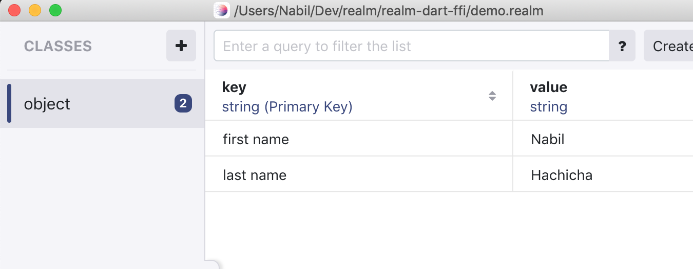

# realm-dart-ffi
Experimental Realm binding using `dart:ffi` [preview support](https://github.com/dart-lang/sdk/issues/34452#issuecomment-482136759). 

This demo wraps the [Realm](https://realm.io/) database [engine](https://github.com/realm/realm-object-store/) (C++) using a C like interface in order to build a simple Key/Value store, and expose it to dart.

## Building 

- Build the Shared Object library containing Realm with a C wrapper

```
git clone https://github.com/nhachicha/realm-dart-ffi
cd realm-dart-ffi
git submodule update --init --recursive
cd lib/src/cpp
cmake .
make
```

## Running 

__This project requires Dart `2.5.0-dev.1.0` to run.__

_on macOS you can update Dart by running `brew install dart --devel`_

<!-- ### Example 
- Run the example (from the root directory `realm-dart-ffi`)
```
realm-dart-ffi> pub get
realm-dart-ffi> pub run example/main
```

This should persist two keys, then retrieve them.

```
Creating database demo.realm
Put key: first name value: Nabil
Put key: last name value: Hachicha
Get key: first name
Get key: last name
Hello Nabil Hachicha
Closing database 
```
- [Example](./example/main.dart):
```Dart
  Database d = Database("demo.realm");
  d.put("first name", "Nabil");
  String firstName = d.get("first name");
```

You can also inspect the generated Realm database using [Realm Studio](https://realm.io/products/realm-studio/)
 -->

### Tests
<!-- update with 'pub run build_runner test' once we add code gen  -->
- All tests `pub run test lib/test` _(test runner considers any file that ends with _test.dart to be a test file)_
- Specific test file `pub run test lib/test/api_test.dart`
- Specific tests cases to run by name `pub run test lib/test -n "test name"`

